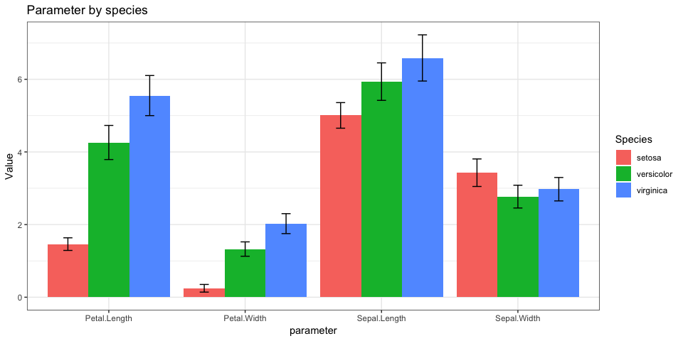

Iris Data Set
-------------

This is probably the most versatile, easy and resourceful dataset in
pattern recognition literature. Nothing could be simpler than the Iris
dataset to learn classification techniques. If you are totally new to
data science, this is your start line. The data has only 150 rows & 4
columns.

Problem: Predict the class of the flower based on available attributes.

Exploratory analysis
--------------------

To find out the best parameters (out of the four) to predict Species, we
first plot them by species.

    library(tidyverse)
    data("iris")
    summary(iris)

      Sepal.Length    Sepal.Width     Petal.Length    Petal.Width   
     Min.   :4.300   Min.   :2.000   Min.   :1.000   Min.   :0.100  
     1st Qu.:5.100   1st Qu.:2.800   1st Qu.:1.600   1st Qu.:0.300  
     Median :5.800   Median :3.000   Median :4.350   Median :1.300  
     Mean   :5.843   Mean   :3.057   Mean   :3.758   Mean   :1.199  
     3rd Qu.:6.400   3rd Qu.:3.300   3rd Qu.:5.100   3rd Qu.:1.800  
     Max.   :7.900   Max.   :4.400   Max.   :6.900   Max.   :2.500  
           Species  
     setosa    :50  
     versicolor:50  
     virginica :50  
                    
                    
                    

    iris_summary <- iris %>%
        gather(key = parameter, value = value, - Species) %>%
        group_by(Species, parameter) %>%
        summarize_all(list(mean = mean,sd = sd))
    ggplot(data = iris_summary, aes(x = parameter, y = mean, fill = Species)) +
        geom_bar(position = position_dodge(), stat = "identity") +
        geom_errorbar(aes(ymin = mean - sd, ymax = mean + sd), position = position_dodge(0.9), width = 0.2) +
        theme_bw() +
        labs(title = "Parameter by species", y = "Value")

We then perform anova tests to find out if these parameters
significantly differ across species.

    summary(aov(Sepal.Length ~ Species, data = iris))

                 Df Sum Sq Mean Sq F value Pr(>F)    
    Species       2  63.21  31.606   119.3 <2e-16 ***
    Residuals   147  38.96   0.265                   
    ---
    Signif. codes:  0 '***' 0.001 '**' 0.01 '*' 0.05 '.' 0.1 ' ' 1

    TukeyHSD(aov(Sepal.Length ~ Species, data = iris))

      Tukey multiple comparisons of means
        95% family-wise confidence level

    Fit: aov(formula = Sepal.Length ~ Species, data = iris)

    $Species
                          diff       lwr       upr p adj
    versicolor-setosa    0.930 0.6862273 1.1737727     0
    virginica-setosa     1.582 1.3382273 1.8257727     0
    virginica-versicolor 0.652 0.4082273 0.8957727     0

    summary(aov(Sepal.Width ~ Species, data = iris))

                 Df Sum Sq Mean Sq F value Pr(>F)    
    Species       2  11.35   5.672   49.16 <2e-16 ***
    Residuals   147  16.96   0.115                   
    ---
    Signif. codes:  0 '***' 0.001 '**' 0.01 '*' 0.05 '.' 0.1 ' ' 1

    TukeyHSD(aov(Sepal.Width ~ Species, data = iris))

      Tukey multiple comparisons of means
        95% family-wise confidence level

    Fit: aov(formula = Sepal.Width ~ Species, data = iris)

    $Species
                           diff         lwr        upr     p adj
    versicolor-setosa    -0.658 -0.81885528 -0.4971447 0.0000000
    virginica-setosa     -0.454 -0.61485528 -0.2931447 0.0000000
    virginica-versicolor  0.204  0.04314472  0.3648553 0.0087802

    summary(aov(Petal.Length ~ Species, data = iris))

                 Df Sum Sq Mean Sq F value Pr(>F)    
    Species       2  437.1  218.55    1180 <2e-16 ***
    Residuals   147   27.2    0.19                   
    ---
    Signif. codes:  0 '***' 0.001 '**' 0.01 '*' 0.05 '.' 0.1 ' ' 1

    TukeyHSD(aov(Petal.Length ~ Species, data = iris))

      Tukey multiple comparisons of means
        95% family-wise confidence level

    Fit: aov(formula = Petal.Length ~ Species, data = iris)

    $Species
                          diff     lwr     upr p adj
    versicolor-setosa    2.798 2.59422 3.00178     0
    virginica-setosa     4.090 3.88622 4.29378     0
    virginica-versicolor 1.292 1.08822 1.49578     0

    summary(aov(Petal.Width ~ Species, data = iris))

                 Df Sum Sq Mean Sq F value Pr(>F)    
    Species       2  80.41   40.21     960 <2e-16 ***
    Residuals   147   6.16    0.04                   
    ---
    Signif. codes:  0 '***' 0.001 '**' 0.01 '*' 0.05 '.' 0.1 ' ' 1

    TukeyHSD(aov(Petal.Width ~ Species, data = iris))

      Tukey multiple comparisons of means
        95% family-wise confidence level

    Fit: aov(formula = Petal.Width ~ Species, data = iris)

    $Species
                         diff       lwr       upr p adj
    versicolor-setosa    1.08 0.9830903 1.1769097     0
    virginica-setosa     1.78 1.6830903 1.8769097     0
    virginica-versicolor 0.70 0.6030903 0.7969097     0

We can tell that all four parameters are significantly different across
species. We will use all of them to train our prediction model.

    library(caret)
    set.seed(996)
    iris_random <- sample_n(iris, nrow(iris))
    inTrain <- createDataPartition(y = iris_random$Species, p = 0.75, list = FALSE)
    training <- iris_random[inTrain,]
    testing <- iris_random[-inTrain,]

    output <- capture.output(iris_model <- caret::train(Species ~ ., data = training, method = "gbm"))
    iris_prediction <- predict(iris_model, newdata = testing)
    confusionMatrix(iris_prediction, testing$Species)

    Confusion Matrix and Statistics

                Reference
    Prediction   setosa versicolor virginica
      setosa         12          0         0
      versicolor      0         12         0
      virginica       0          0        12

    Overall Statistics
                                         
                   Accuracy : 1          
                     95% CI : (0.9026, 1)
        No Information Rate : 0.3333     
        P-Value [Acc > NIR] : < 2.2e-16  
                                         
                      Kappa : 1          
     Mcnemar's Test P-Value : NA         

    Statistics by Class:

                         Class: setosa Class: versicolor Class: virginica
    Sensitivity                 1.0000            1.0000           1.0000
    Specificity                 1.0000            1.0000           1.0000
    Pos Pred Value              1.0000            1.0000           1.0000
    Neg Pred Value              1.0000            1.0000           1.0000
    Prevalence                  0.3333            0.3333           0.3333
    Detection Rate              0.3333            0.3333           0.3333
    Detection Prevalence        0.3333            0.3333           0.3333
    Balanced Accuracy           1.0000            1.0000           1.0000
